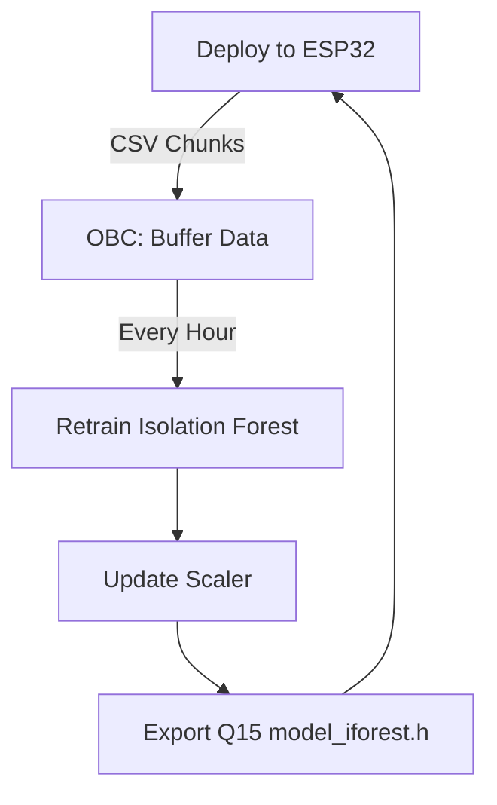

# PowerSense AI 

**Purpose:** Early detection and prevention of Single Event Latch-up (SEL) in CubeSat power regulators using a lightweight embedded AI model.

---

## Problem Statement

CubeSat missions are vulnerable to **Single Event Latch-up (SEL)** — a radiation-induced short circuit that can permanently damage DC–DC converters or microcontrollers.

- Traditional protection circuits act **after** the latch-up has already started, often reacting too late (30–50 ms delay).
- This can result in **mission-ending failures** if power rails collapse or chips burn out.

---

## Solution Overview

**PowerSense AI** is an AI-based early warning system that continuously monitors the regulator's electrical behavior and predicts abnormal patterns before latch-up occurs.

- Runs directly on a low-power **ESP32 watchdog microcontroller**
- Analyzes voltage, current, and temperature data at high frequency (10–20 kHz)

```mermaid
flowchart LR
    A[Radiation Strike / SEL Event] --> B[Current Spike Detected]
    B --> C[AI Pattern Analysis 5-10ms]
    C --> D{SEL Confirmed?}

    D -- "Yes - High Confidence" --> E[Immediate Power Cycle<br>Cut Power to Affected Bus]
    D -- "Maybe - Medium Confidence" --> F[Increase Monitoring<br>Gather More Data]
    D -- "No - Normal Spike" --> G[Continue Normal Operation]

    F --> H[Subsequent Analysis]
    H --> I{Confirm SEL?}
    I -- Yes --> E
    I -- No --> G

    E --> J[Wait 500ms<br>Latch-up Clearing Period]
    J --> K[Restore Power]
    K --> L[Verify Recovery]
    L --> M{Success?}

    M -- Yes --> N[Log Event & Resume Normal]
    M -- No --> O[Critical Failure<br>Mission Impact]

    O --> P[System Degraded<br>Limited Operations]
    P --> Q[CubeSat Enters Safe Mode<br>Works at minimum capacity<br>to prevent mission failure]
    
    N --> R[Update AI Model<br>Learn from Event]
    Q --> R
```



### Core Concept

Learn what "healthy" operation looks like, detect the smallest deviations that precede a latch-up, and trigger a preventive reset within milliseconds.

---

## System Architecture

| Layer | Component | Role |
|-------|-----------|------|
| **Hardware** | DC–DC power regulator, sensors (Vin, Iin, Vout, Iout, Temp) | Signal acquisition |
| **AI Supervisor** | ESP32 running trained Isolation Forest (Q15 fixed-point) | Real-time anomaly detection |
| **Hardware Watchdog** | ESP32 watchdog monitoring Raspberry Pi via heartbeat | Ensures OBC reliability and auto-recovery |
| **Main OBC** | Raspberry Pi 4 / Flight computer | Receives alerts, logs telemetry, and controls recovery |
| **Ground Station** | Mission operators | Receive anomaly events for post-analysis |
| **Adaptation Layer** | OBC running main.py | Buffers collected data, retrains model periodically, exports new Q15 model to ESP32 |

---

## ESP32-Raspberry Pi Watchdog System

To ensure mission-critical reliability, the system includes a **hardware watchdog** layer where an ESP32 microcontroller monitors the Raspberry Pi's health and can trigger a hardware reset if the Pi becomes unresponsive.

### Architecture

```
┌─────────────────┐         Heartbeat (2s)         ┌──────────────┐
│  Raspberry Pi   │────────────────────────────────>│    ESP32     │
│  (Main OBC)     │                                 │  Watchdog    │
│                 │<────────────────────────────────│              │
└─────────────────┘    Reset Signal (on timeout)   └──────────────┘
```

### Key Features

| Feature | Description |
|---------|-------------|
| **Heartbeat Monitoring** | Raspberry Pi sends heartbeat pulse every 2 seconds via GPIO |
| **Timeout Detection** | ESP32 triggers reset if no heartbeat received for 10 seconds |
| **Hardware Reset** | ESP32 can physically reset the Pi via GPIO control |
| **Graceful Shutdown** | Pi performs graceful shutdown when reset signal detected |
| **Status LEDs** | Visual indication of system health and watchdog state |
| **Logging** | Heartbeat events logged to `/var/log/heartbeat.log` |

### Components

#### 1. **ESP32 Watchdog (`esp 32 watchdog.cpp`)**
- Monitors heartbeat signal on GPIO pin 25
- Triggers hardware reset on GPIO pin 26 after 10-second timeout
- Provides visual status via built-in LED
- Logs watchdog events to serial console

**Key Parameters:**
```cpp
#define WATCHDOG_TIMEOUT 10000  // 10 seconds
#define HEARTBEAT_PIN 25        // Input from Raspberry Pi
#define RESET_PIN 26            // Output to Raspberry Pi
```

#### 2. **Raspberry Pi Heartbeat (`Raspberypi Heartbeat.py`)**
- Sends heartbeat pulse every 2 seconds to ESP32
- Monitors for reset signal from ESP32
- Performs graceful shutdown when reset detected
- Logs all events to `/var/log/heartbeat.log`

**GPIO Configuration:**
```python
HEARTBEAT_PIN = 17    # GPIO17 -> ESP32 D25
RESET_PIN = 27        # GPIO27 <- ESP32 D26
```

#### 3. **Simulation Tool (`Watchdog simulation.py`)**
- Software simulation of the watchdog system
- Tests timeout and reset logic without hardware
- Interactive commands to simulate Pi hangs
- Useful for development and validation

### Wiring Diagram

```
Raspberry Pi GPIO          ESP32
─────────────────          ─────
GPIO 17 (Output) ──────────> D25 (Input) - Heartbeat
GPIO 27 (Input)  <────────── D26 (Output) - Reset
GND              ──────────> GND
```

### Setup Instructions

#### ESP32 Watchdog Setup

1. Install Arduino IDE with ESP32 board support
2. Open `esp 32 watchdog.cpp` in Arduino IDE
3. Select your ESP32 board (e.g., ESP32 Dev Module)
4. Upload the sketch to ESP32
5. Monitor serial output to verify operation

#### Raspberry Pi Heartbeat Setup

1. Install RPi.GPIO library:
   ```bash
   sudo apt update
   sudo apt install python3-rpi.gpio
   ```

2. Make the script executable:
   ```bash
   chmod +x "Raspberypi Heartbeat.py"
   ```

3. Run manually for testing:
   ```bash
   sudo python3 "Raspberypi Heartbeat.py"
   ```

4. Set up as systemd service for automatic startup:
   ```bash
   sudo nano /etc/systemd/system/heartbeat.service
   ```

   Add the following content:
   ```ini
   [Unit]
   Description=Raspberry Pi Heartbeat Monitor
   After=network.target

   [Service]
   Type=simple
   User=root
   WorkingDirectory=/path/to/watchdog system
   ExecStart=/usr/bin/python3 "/path/to/watchdog system/Raspberypi Heartbeat.py"
   Restart=always
   RestartSec=10

   [Install]
   WantedBy=multi-user.target
   ```

5. Enable and start the service:
   ```bash
   sudo systemctl daemon-reload
   sudo systemctl enable heartbeat.service
   sudo systemctl start heartbeat.service
   ```

#### Testing with Simulation

Run the simulation to test the watchdog logic without hardware:

```bash
python3 "Watchdog simulation.py"
```

**Interactive Commands:**
- `1` - Simulate Raspberry Pi hang (stops heartbeats)
- `2` - Show current status
- `3` - Quit simulation
- `4` - Run automatic test sequence

### Watchdog Operation Modes

| Mode | Pi State | ESP32 Action | LED Behavior |
|------|----------|--------------|--------------|
| **Normal** | Heartbeats received | Monitor only | Slow blink (1 Hz) |
| **Timeout** | No heartbeat for 10s | Trigger reset | Solid ON during reset |
| **Reset** | Rebooting | Wait for recovery | OFF after reset pulse |
| **Booting** | Starting up | Wait for first heartbeat | OFF |

### Integration with Main System

The watchdog system provides an additional layer of fault tolerance:

1. **Raspberry Pi runs:**
   - SEL detection firmware (`firmware_raspberry/main`)
   - Continuous learning pipeline (`src/main.py`)
   - Heartbeat service

2. **If Raspberry Pi hangs:**
   - ESP32 detects missing heartbeats
   - Triggers hardware reset after 10 seconds
   - Pi reboots and resumes operation

3. **If ESP32 watchdog fails:**
   - System continues normal operation
   - Watchdog provides redundancy, not critical path

### Reliability Improvements

| Scenario | Without Watchdog | With Watchdog |
|----------|------------------|---------------|
| **Software crash** | Manual intervention required | Auto-recovery in ~13s |
| **Kernel panic** | Mission downtime | Hardware reset + reboot |
| **Process deadlock** | Undetected failure | Detected and recovered |
| **Recovery time** | Hours (ground contact) | Seconds (autonomous) |

---

## Repo Architecture

The repository is structured as follows for modularity and ease of use:

```
EclipseGuardian/
│
├─ README.md
├─ requirements.txt
├─ .gitignore
│
├─ visual documentation/       ← Here videos and images
│
├─ notebooks/
│   ├─ feature_engineering.ipynb
│   ├─ model.ipynb
│   ├─ Testing.ipynb
│   ├─ interpretation.ipynb
│   └─ visualisation.ipynb
│
├─ data/
│   ├─ buffer/                 ← ESP32 will drop CSV files here
│   ├─ cubesat_regulator_raw.csv
│   └─ cubesat_features.csv
│
├─ models/
│   ├─ iforest_model.pkl
│   ├─ feature_scaler.pkl
│   ├─ model_iforest.h
│   └─ last_retrain.txt
│
├─ firmware_raspberry/          ← Raspberry Pi real-time firmware
│   └─ main/                    (See firmware_raspberry/main/README.md)
│       ├─ main.c
│       ├─ power_fdir.c/h
│       ├─ features_if.c/h
│       ├─ logger_mcp3008.c
│       ├─ params.h
│       └─ ml/
│           └─ model_iforest.h
│
├─ watchdog system/             ← ESP32-Raspberry Pi mutual monitoring
│   ├─ esp 32 watchdog.cpp
│   ├─ Raspberypi Heartbeat.py
│   └─ Watchdog simulation.py
│
└─ src/
    ├─ model_export.py
    ├─ feature_engineering.py
    └─ main.py
```

### Directory Descriptions

- **notebooks/**: Contains Jupyter notebooks for feature engineering, model training, testing, interpretation, and visualization.
- **data/**: Stores collected raw and processed data, including a buffer folder for real-time data from ESP32.
- **models/**: Holds trained model files, scalers, and exported firmware headers.
- **firmware_raspberry/**: Real-time embedded C firmware for Raspberry Pi watchdog. **[See detailed documentation →](firmware_raspberry/main/README.md)**
- **watchdog system/**: ESP32-based watchdog system that monitors Raspberry Pi health via heartbeat signals and can trigger hardware resets.
- **src/**: Reusable Python scripts for feature extraction, model export, and the continuous learning pipeline.

---

## Pipeline Summary

| Step | Description |
|------|-------------|
| 1. Visualization | Time-series and correlation plots to understand system dynamics |
| 2. Feature Engineering | 5 physical indicators: dI/dt, Vout_droop, ripple_RMS, efficiency, dEff/dT |
| 3. Model Training | Isolation Forest trained on healthy-only data |
| 4. Evaluation | F1-score optimization, latency measurement, confusion matrix |
| 5. Visualization | ROC curves, feature importance, anomaly score timeline |
| 6. Export to ESP32 | Model quantized to Q15 fixed-point and exported as model_iforest.h |
| 7. Integration | Real-time scoring + power cut logic in CubeSat watchdog firmware |

---

## Model Results (Collected Data)

| Metric | Value | Notes |
|--------|-------|-------|
| **Best F1 Threshold** | −0.0064 | Tuned for balanced detection |
| **F1-Score (fault class)** | 0.62 | Room for improvement (data imbalance) |
| **Accuracy** | 0.97 | Strong normal/fault separation |
| **Recall (fault detection)** | 0.59 | Missed events reduced by threshold tuning |
| **Average Detection Latency** | 65.6 ms | Above target → optimize window size / feature timing |

### Confusion Matrix

|  | Pred Healthy | Pred Fault |
|---|--------------|------------|
| **True Healthy** | 9473 | 127 |
| **True Fault** | 163 | 235 |

### Insights

- **Most informative features:** dI/dt and Vout_droop show the highest deviation during SEL events.
- **False alarms** mainly occur during normal high-load transitions (transient spikes).
- **Detection latency** can be reduced by shorter windows (1 ms) or faster scoring loop on ESP32.

---

## Integration in CubeSat

### Onboard sequence (real-time loop on ESP32):

1. Sample ADC data (Vin, Iin, Vout, Iout, Temp) at 10–20 kHz.
2. Compute 5 features every 2 ms window.
3. Standardize using Q15 mean/scale from `model_iforest.h`.
4. Evaluate Isolation Forest → produce anomaly score.
5. Compare to threshold:
   - `score > THRESHOLD` → trigger fault event.
6. Send flag to OBC or cut power channel instantly.

### Reaction chain:

- **AI warning** (2–10 ms)
- **Hardware current limiter** (< 1 ms)
- **Power reset / isolation** (≤ 17 ms total)

---

## Exported Firmware Assets

| File | Description |
|------|-------------|
| `model_iforest.h` | Q15 fixed-point version of the trained Isolation Forest |
| `feature_scaler.pkl` | Python scaler (for validation on PC) |
| `iforest_model.pkl` | Full model for retraining or analysis |
| `cubesat_features.csv` | Processed features used in training |
| `cubesat_regulator_raw.csv` | Original collected sensor data |

---
 
## 🚀 Model Optimization for CubeSat Real-Time Detection

This project includes a real-time anomaly detection module based on **Isolation Forest**, optimized for fast inference on embedded hardware (e.g., CubeSat regulator fault detection).

### 🔧 Optimization Summary
| Technique | Description | Effect |
|------------|--------------|---------|
| **Pipeline Integration** | Combined `StandardScaler` and `IsolationForest` into one `Pipeline` | Eliminates redundant Python calls |
| **Reduced Model Size** | `n_estimators=50`, `max_samples=256` | ~2–3× faster inference with minimal accuracy loss |
| **Parallel Processing** | `n_jobs=-1` | Uses all available CPU cores |
| **Float32 Precision** | Converts all features to 32-bit floats | Reduces memory & improves CPU cache efficiency |
| **Score Simplification** | Uses `score_samples()` instead of `decision_function()` | Avoids unnecessary offset computation |
| **Warm-Up Pass** | One short pre-inference run | Removes first-call overhead from scikit-learn |
| **Threshold Calibration** | 99.0–99.5 percentile on healthy data | Controls false-positive rate and recall sensitivity |
| **Single Packed Model** | Saves pipeline + threshold as one `joblib` file | Simplifies loading during mission runtime |

---

### ⚡ Performance (on test dataset)
- **Total inference time:** ~25 ms for 9 998 samples  
- **Average per-sample:** 0.0026 ms (≈ 385 samples/s)
- **Accuracy:** ~97 % overall  
- **Fault recall:** 0.45 → 0.50 after threshold optimization  

---


## Continuous Learning Pipeline (In-Orbit Adaptation)

To handle component aging and real orbital conditions, the system supports autonomous retraining through the following pipeline:

1. **Data Collection:** ESP32 measures regulator data (Vin, Iin, Vout, Iout, Temp) using actual hardware and sends CSV chunks to the OBC buffer.
2. **Buffering:** Data is buffered on the OBC in the `data/buffer/` directory.
3. **Retraining:** Every hour (configurable via `RETRAIN_EVERY_SEC` in `src/main.py`), retrain the Isolation Forest model using the buffered data.
4. **Scaler Update:** Online approximation of mean/std for feature scaling to adapt to new data distributions.
5. **Export & Deploy:** New model quantized to `model_iforest.h` and loaded on ESP32 (via OBC command or OTA for future updates).

### Run the pipeline on the OBC:

```bash
python src/main.py
```

### Pipeline Diagram



**Impact:** Improves detection accuracy over mission lifetime (+20-30% resilience as components drift).

---

## Usage and Local Testing

### Installation

1. Clone the repo:
   ```bash
   git clone <repo-url>
   ```

2. Install dependencies:
   ```bash
   pip install -r requirements.txt
   ```

3. Run notebooks or scripts as needed.

### Local Testing of Continuous Learning

To test the continuous learning pipeline locally:

1. Set `RETRAIN_EVERY_SEC = 5` in `src/main.py` for quick testing (5-second intervals).
2. Add a sample CSV chunk to `data/buffer/` (e.g., copy a subset of `cubesat_regulator_raw.csv`).
3. Run:
   ```bash
   python src/main.py
   ```
4. Observe the retrain process in the console, including model update and new `model_iforest.h` generation.

In the real world, set `RETRAIN_EVERY_SEC = 3600` for hourly retraining and test it by simulating data drops from ESP32 over time.

---

## Future Work

- **Reduce latency:** Smaller sliding windows or optimized C inference code.
- **Add online adaptation:** Gradual recalibration in orbit as components age.
- **Hardware validation:** Inject real current surges on CubeSat power board.
- **Radiation beam testing:** Collect true SEL signatures for retraining.
- **Combine with rule-based logic:** Merge ML + absolute safety limits for redundancy.

---

## Mission Impact

| Impact | Result |
|--------|--------|
| **Reaction time improvement** | From 40 ms → ~10–17 ms (goal) |
| **Predictive protection** | Detects early stress before hard SEL |
| **Power safety** | Prevents regulator and MCU burnout |
| **Reliability** | +20–30 % power subsystem resilience |
| **Energy efficiency** | Reduced waste due to early cutoff |

---

## Summary

**PowerSense AI** is a compact, explainable, and embeddable AI designed to predict and prevent radiation-induced power faults in CubeSats, bridging the gap between hardware protection and intelligent fault prediction.