# Raspberry Pi Firmware - Real-Time SEL Detection

This directory contains the **real-time firmware implementation** for the PowerSense Detector running on a Raspberry Pi. The firmware monitors power regulator telemetry at high frequency and uses an embedded AI model (Isolation Forest) to detect anomalies that precede Single Event Latch-up (SEL) events.

---

##  Directory Structure

```
firmware_raspberry/main/
├── main.c                 # Main control loop (1 ms cadence)
├── power_fdir.c           # FDIR state machine and GPIO control
├── power_fdir.h           # FDIR interface definitions
├── features_if.c          # Feature computation and IF scoring
├── features_if.h          # Feature vector and ring buffer interface
├── logger_mcp3008.c       # High-speed ADC data logger (MCP3008 SPI)
├── params.h               # Configurable parameters (thresholds, timing, GPIO)
└── ml/
    └── model_iforest.h    # Exported Q15 Isolation Forest model
```

---

##  Overview

### Purpose

This firmware acts as a **watchdog supervisor** that:
1. Continuously samples voltage, current, and temperature from the power regulator
2. Computes 5 engineered features every 2 ms window with 1 ms hop
3. Scores each feature vector using an embedded Isolation Forest model
4. Triggers Fault Detection, Isolation, and Recovery (FDIR) actions when anomalies are detected

### Key Features

- **Real-time execution:** 1 ms loop with optional real-time scheduling (SCHED_FIFO)
- **Hybrid detection:** Combines AI scoring with rule-based safety guards
- **FDIR state machine:** Handles fault → power cut → hold → restart → verify → recovery
- **GPIO control:** Manages regulator enable (EN) and optional eFuse via libgpiod
- **Embedded AI:** Lightweight Isolation Forest model for anomaly scoring
- **Configurable:** All thresholds, timing, and GPIO pins in `params.h`

---

##  Signal Processing Pipeline

```mermaid
graph LR
    A[ADC Samples<br/>10 kHz] --> B[Ring Buffer<br/>feats_push_raw]
    B --> C[Feature Extraction<br/>2 ms window, 1 ms hop]
    C --> D[5 Features:<br/>dI/dt, Vout_droop, ripple_RMS,<br/>efficiency, dEff/dT]
    D --> E[Standardization<br/>Q15 scaler]
    E --> F[Isolation Forest<br/>Score]
    F --> G{Score > Threshold?}
    G -->|Yes| H[FDIR State Machine]
    G -->|No| I[Continue Monitoring]
    H --> J[Power Cut → Hold → Restart → Verify]
```



---

##  Hardware Requirements

| Component | Description | Notes |
|-----------|-------------|-------|
| **Raspberry Pi** | Pi 3/4 or compatible | Runs main control loop |
| **ADC** | MCP3008 (SPI) or similar | 6 channels: Vin, Iin, Vout, Iout, Temp, Ripple |
| **Power Regulator** | DC-DC converter under test | Must have EN pin for enable/disable |
| **Optional eFuse** | Load switch or eFuse IC | For additional power isolation |
| **Sensors** | Current shunt, voltage dividers, temperature sensor | Measure regulator telemetry |

### GPIO Pin Configuration (edit in `params.h`)

```c
#define GPIOCHIP_NAME    "gpiochip0"   // Raspberry Pi GPIO chip
#define PIN_REG_EN       5             // BCM GPIO for regulator enable
#define PIN_EFUSE_EN     -1            // Optional eFuse enable (-1 = unused)
```

---

##  Key Parameters (`params.h`)

### Sampling & Windows

| Parameter | Default | Description |
|-----------|---------|-------------|
| `FS_HZ` | 10000 | Raw sample rate feeding feature extraction (Hz) |
| `WIN_MS` | 2 | Feature window length (ms) |
| `HOP_MS` | 1 | Hop between windows (ms) → 50% overlap |

### Detection Policy

| Parameter | Default | Description |
|-----------|---------|-------------|
| `DWELL_HITS` | 2 | Consecutive anomalous windows required to trigger |
| `HOLDOFF_MS` | 10 | Power-off duration to clear latch (ms) |
| `VERIFY_MS` | 100 | Post-restart verification period (ms) |

### Rule-Based Thresholds

| Parameter | Default | Description |
|-----------|---------|-------------|
| `THR_DIDT_A_PER_MS` | 0.8 | Current rate-of-change threshold (A/ms) |
| `THR_DROOP_V` | 0.040 | Output voltage droop threshold (V) |
| `THR_RIPPLE_V` | 0.030 | Ripple RMS threshold (V) |
| `USE_RIPPLE` | 0 | Enable/disable ripple feature (0 = ignore) |

### AI Model

| Parameter | Default | Description |
|-----------|---------|-------------|
| `IF_THRESHOLD_F_FALLBACK` | 0.56 | Fallback threshold if not in model header |

---

## 🧠 Feature Engineering

The firmware computes 5 features per window:

| Feature | Symbol | Units | Physical Meaning |
|---------|--------|-------|------------------|
| **Current slew rate** | `dI_dt` | A/ms | Rapid load changes or latch onset |
| **Output voltage droop** | `Vout_droop` | V | Deviation from nominal Vout |
| **Ripple RMS** | `ripple_RMS` | V | AC ripple magnitude (optional) |
| **Efficiency** | `efficiency` | 0..1.2 | Pout / Pin ratio |
| **Efficiency temp. coeff.** | `dEff_dT` | 1/°C | Efficiency change per degree |

These features are computed in `features_if.c` using a ring buffer and standardized before scoring.

---

## 🔁 FDIR State Machine

The fault detection and recovery logic operates as a finite state machine with 4 states:

| State | Description | Transitions |
|-------|-------------|-------------|
| **NORMAL** | Monitoring mode | → HOLD if `DWELL_HITS` consecutive anomalies detected |
| **HOLD** | Power cut for `HOLDOFF_MS` | → VERIFY after holdoff expires |
| **VERIFY** | Power restored, monitoring for re-latch | → NORMAL if stable<br/>→ SAFE if re-latch detected |
| **SAFE** | Permanent shutdown (manual recovery) | Requires operator intervention |

### State Diagram

```
NORMAL ──[anomaly × DWELL_HITS]──> HOLD ──[holdoff done]──> VERIFY
  ↑                                                            │
  │                                                            │
  └──[stable]──────────────────────────────────────[relatch]──┘
                                                               │
                                                               ↓
                                                             SAFE
```

---

## 🏗️ Compilation

### Dependencies

- **libgpiod** - Modern GPIO control library
- **pthread** - Threading support (for real-time scheduling)
- **Standard C library** (libc)

Install on Raspberry Pi OS:

```bash
sudo apt update
sudo apt install libgpiod-dev
```

### Build Command

```bash
gcc -O3 -Wall -Wextra -std=c11 \
    -o sel_detector \
    main.c \
    power_fdir.c \
    features_if.c \
    -lgpiod -lpthread -lm -lrt
```

### Build Logger (Optional)

To compile the standalone high-speed data logger:

```bash
gcc -O3 -Wall -o logger_mcp3008 logger_mcp3008.c -lrt -lm
```

---

## ▶️ Running the Firmware

### Basic Execution

```bash
./sel_detector
```

### With Real-Time Priority (Recommended)

For deterministic 1 ms timing, run with RT privileges:

```bash
sudo chrt -f 80 ./sel_detector
```

Or grant CAP_SYS_NICE capability:

```bash
sudo setcap cap_sys_nice=eip sel_detector
./sel_detector
```

### Expected Console Output

```
IF threshold = 0.560000 ; loop hop = 1 ms
[Monitoring started at 1 ms cadence...]
```

When an anomaly is detected:

```
[FDIR] Anomaly detected! Score=0.623 Hits=2/2 → POWER CUT
[FDIR] Holdoff complete → Restarting power
[FDIR] Verification passed → NORMAL
```

---

## 🧪 Testing & Validation

### 1. Bench Testing (No Hardware)

Modify `read_latest_raw()` in `power_fdir.c` to inject synthetic data:

```c
void read_latest_raw(float* vin, float* iin, float* vout, float* iout, float* temp, float* ripple){
  *vin = 12.0f;
  *iin = 0.5f;
  *vout = 5.0f;
  *iout = 1.0f;
  *temp = 25.0f;
  *ripple = 0.01f;
  
  // Inject fault at t=5s
  static int counter = 0;
  if (++counter > 5000 && counter < 5100){
    *iin = 3.0f;    // Current spike
    *vout = 4.6f;   // Voltage sag
  }
}
```

### 2. Hardware-in-the-Loop

Connect real ADC (MCP3008) and power regulator:

1. Verify SPI communication: `./logger_mcp3008` should log raw ADC values
2. Run `./sel_detector` and observe FDIR actions during load transients
3. Inject controlled fault (e.g., short circuit downstream) and verify power cut

### 3. Latency Measurement

Add timestamps in `main.c`:

```c
struct timespec t0, t1;
clock_gettime(CLOCK_MONOTONIC, &t0);
const float score = iforest_score(&feats);
clock_gettime(CLOCK_MONOTONIC, &t1);
double latency_us = (t1.tv_sec - t0.tv_sec)*1e6 + (t1.tv_nsec - t0.tv_nsec)/1e3;
printf("Score: %.4f | Latency: %.2f µs\n", score, latency_us);
```

---

## 📦 Integration with Main Project

This firmware is designed to work alongside the Python-based continuous learning pipeline. The integration flow is:

1. **Python pipeline** (`src/main.py`) trains/updates the Isolation Forest model
2. **Model export** (`src/model_export.py`) generates `model_iforest.h` with Q15 coefficients
3. **Copy header** to `firmware_raspberry/main/ml/model_iforest.h`
4. **Recompile firmware** to use the updated model
5. **Deploy** to Raspberry Pi watchdog

See the [main project README](../../README.md) for full pipeline details.

---

## 🔗 File Descriptions

### Core Files

| File | Responsibility |
|------|----------------|
| **main.c** | Main control loop: ADC sampling → feature extraction → scoring → FDIR |
| **power_fdir.c/h** | GPIO initialization, power control, FDIR state machine |
| **features_if.c/h** | Ring buffer, feature computation, IF scoring, rule guards |
| **params.h** | Compile-time configuration (thresholds, timing, GPIO pins) |
| **ml/model_iforest.h** | Exported Q15 model (trees, thresholds, scalers) |

### Utility

| File | Purpose |
|------|---------|
| **logger_mcp3008.c** | Standalone data logger for collecting training data at high speed |

---


